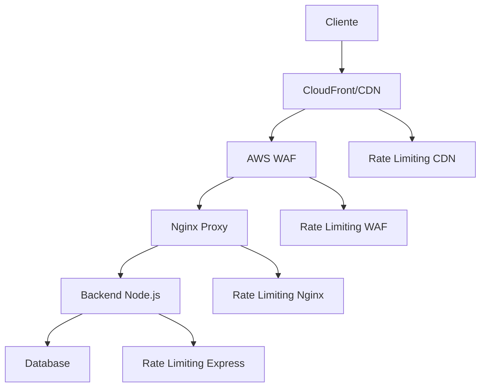

# 🔒 Rate Limiting - Configuração Completa

## 📋 Visão Geral

Este documento descreve a configuração de **rate limiting** implementada em múltiplas camadas para garantir segurança e estabilidade da aplicação.

---

## 🏗️ **Arquitetura de Rate Limiting**

### **Camadas de Proteção:**



---

## 🔧 **Configurações por Camada**

### **1. AWS WAF (Produção)**

#### **Configuração:**
```json
{
  "name": "RateLimitRule",
  "priority": 1,
  "action": "BLOCK",
  "rate_limit": 2000
}
```

#### **Limites:**
- **2000 requisições por IP** a cada 5 minutos
- **Ação**: Bloquear requisições excedentes
- **Prioridade**: 1 (mais alta)

#### **Benefícios:**
- ✅ **Proteção na borda** da rede
- ✅ **Redução de carga** no servidor
- ✅ **Proteção contra DDoS**
- ✅ **Configuração global** para todos os endpoints

---

### **2. Nginx (Frontend/Proxy)**

#### **Configuração:**
```nginx
# Rate limiting zones
limit_req_zone $binary_remote_addr zone=api:10m rate=10r/s;
limit_req_zone $binary_remote_addr zone=login:10m rate=1r/s;

# Aplicação do rate limiting
limit_req zone=api burst=20 nodelay;
```

#### **Limites:**
- **API geral**: 10 requisições por segundo por IP
- **Login**: 1 requisição por segundo por IP
- **Burst**: 20 requisições extras permitidas
- **Zona de memória**: 10MB para armazenar IPs

#### **Benefícios:**
- ✅ **Proteção no proxy** reverso
- ✅ **Limites por segundo** (mais granular)
- ✅ **Burst handling** para picos de tráfego
- ✅ **Eficiência de memória**

---

### **3. Backend Node.js (Express)**

#### **Configuração:**
```javascript
// Rate Limiting Global
const globalLimiter = rateLimit({
  windowMs: 15 * 60 * 1000, // 15 minutos
  max: 100, // 100 requisições por IP
  standardHeaders: true,
  legacyHeaders: false
});

// Rate Limiting para Autenticação
const authLimiter = rateLimit({
  windowMs: 15 * 60 * 1000, // 15 minutos
  max: 5, // 5 tentativas de login por IP
});

// Rate Limiting para Operações Bancárias
const bankingLimiter = rateLimit({
  windowMs: 60 * 1000, // 1 minuto
  max: 10, // 10 operações por IP
});
```

#### **Limites:**
- **Global**: 100 requisições por IP a cada 15 minutos
- **Autenticação**: 5 tentativas de login por IP a cada 15 minutos
- **Operações Bancárias**: 10 operações por IP a cada 1 minuto

#### **Headers Retornados:**
```
X-RateLimit-Limit: 100
X-RateLimit-Remaining: 95
X-RateLimit-Reset: 1640995200
```

#### **Respostas de Erro:**
```json
{
  "success": false,
  "error": {
    "code": "RATE_LIMIT_EXCEEDED",
    "message": "Muitas requisições. Tente novamente em alguns minutos.",
    "details": "Limite de requisições excedido. Aguarde antes de fazer novas requisições.",
    "retryAfter": 15
  }
}
```

---

## 📊 **Comparação de Limites**

| Camada | Limite | Janela | Aplicação |
|--------|--------|--------|-----------|
| **AWS WAF** | 2000 req/IP | 5 minutos | Todos os endpoints |
| **Nginx** | 10 req/IP/s | 1 segundo | Todos os endpoints |
| **Nginx Login** | 1 req/IP/s | 1 segundo | Endpoints de auth |
| **Backend Global** | 100 req/IP | 15 minutos | Todos os endpoints |
| **Backend Auth** | 5 req/IP | 15 minutos | Endpoints de auth |
| **Backend Banking** | 10 req/IP | 1 minuto | Operações bancárias |

---

## 🎯 **Estratégia de Rate Limiting**

### **1. Defesa em Profundidade**

#### **Camada Externa (WAF):**
- **Proteção contra ataques** em larga escala
- **Redução de carga** nos servidores
- **Configuração global** e simples

#### **Camada de Proxy (Nginx):**
- **Limites por segundo** para controle granular
- **Burst handling** para tráfego legítimo
- **Proteção contra** ataques de força bruta

#### **Camada de Aplicação (Backend):**
- **Limites específicos** por endpoint
- **Headers informativos** para clientes
- **Mensagens de erro** detalhadas

### **2. Limites Diferenciados**

#### **Endpoints Públicos:**
- **Health checks**: Sem limite
- **Documentação**: Limite alto
- **Login**: Limite baixo (segurança)

#### **Endpoints Autenticados:**
- **CRUD básico**: Limite médio
- **Operações bancárias**: Limite baixo (segurança)
- **Relatórios**: Limite baixo (performance)

---

## 🔧 **Configuração por Ambiente**

### **Desenvolvimento:**
```env
RATE_LIMIT_WINDOW_MS=900000    # 15 minutos
RATE_LIMIT_MAX_REQUESTS=1000   # 1000 requisições (mais permissivo)
```

### **Produção:**
```env
RATE_LIMIT_WINDOW_MS=900000    # 15 minutos
RATE_LIMIT_MAX_REQUESTS=100    # 100 requisições (mais restritivo)
```

### **Testes:**
```env
RATE_LIMIT_WINDOW_MS=900000    # 15 minutos
RATE_LIMIT_MAX_REQUESTS=1000   # 1000 requisições (para testes)
```

---

## 🧪 **Testes de Rate Limiting**

### **1. Teste Automatizado:**
```bash
# Executar teste de rate limiting
node src/scripts/test-rate-limiting.js
```

### **2. Teste Manual:**
```bash
# Testar limite global
for i in {1..105}; do
  curl -H "Authorization: Bearer $TOKEN" http://localhost:8080/api/clientes
done

# Testar limite de autenticação
for i in {1..7}; do
  curl -X POST http://localhost:8080/api/auth/login \
    -H "Content-Type: application/json" \
    -d '{"username":"admin","password":"wrong"}'
done

# Testar limite de operações bancárias
for i in {1..12}; do
  curl -X POST http://localhost:8080/api/clientes/1/depositar \
    -H "Authorization: Bearer $TOKEN" \
    -H "idempotency-key: test-$i" \
    -H "Content-Type: application/json" \
    -d '{"valor": 1.00}'
done
```

### **3. Verificar Headers:**
```bash
curl -I -H "Authorization: Bearer $TOKEN" http://localhost:8080/api/clientes
```

**Resposta esperada:**
```
HTTP/1.1 200 OK
X-RateLimit-Limit: 100
X-RateLimit-Remaining: 99
X-RateLimit-Reset: 1640995200
```

---

## 📈 **Monitoramento e Métricas**

### **1. Headers de Rate Limiting:**
- `X-RateLimit-Limit`: Limite de requisições
- `X-RateLimit-Remaining`: Requisições restantes
- `X-RateLimit-Reset`: Timestamp de reset

### **2. Logs de Rate Limiting:**
```javascript
// Log quando rate limit é excedido
logger.warn('Rate limit exceeded', {
  ip: req.ip,
  endpoint: req.path,
  limit: req.rateLimit.limit,
  remaining: req.rateLimit.remaining,
  resetTime: req.rateLimit.resetTime
});
```

### **3. Métricas CloudWatch:**
- **Rate limit hits**: Número de vezes que o limite foi excedido
- **Requests per IP**: Distribuição de requisições por IP
- **Endpoint usage**: Uso por endpoint

---

## 🚨 **Considerações de Segurança**

### **1. Bypass de Rate Limiting:**
- **IP spoofing**: Mitigado pelo WAF
- **Proxy rotation**: Detectado por padrões
- **Bot networks**: Mitigado por múltiplas camadas

### **2. False Positives:**
- **Load balancers**: Configurar para preservar IP real
- **CDN**: Configurar headers X-Forwarded-For
- **Proxies**: Configurar para usar IP do cliente

### **3. Configurações Recomendadas:**
```javascript
// Configurar para usar IP real
app.set('trust proxy', 1);

// Configurar rate limiting por IP real
const limiter = rateLimit({
  keyGenerator: (req) => {
    return req.headers['x-forwarded-for'] || req.ip;
  }
});
```

---

## 🔄 **Atualizações e Manutenção**

### **1. Ajuste de Limites:**
```bash
# Ajustar limites baseado no uso
# Monitorar métricas de rate limiting
# Ajustar conforme necessário
```

### **2. Whitelist de IPs:**
```javascript
// Permitir IPs específicos
const limiter = rateLimit({
  skip: (req) => {
    const whitelist = ['192.168.1.1', '10.0.0.1'];
    return whitelist.includes(req.ip);
  }
});
```

### **3. Blacklist de IPs:**
```javascript
// Bloquear IPs maliciosos
const limiter = rateLimit({
  skip: (req) => {
    const blacklist = ['1.2.3.4', '5.6.7.8'];
    return blacklist.includes(req.ip);
  }
});
```

---

## 📚 **Referências**

- [Express Rate Limit](https://github.com/nfriedly/express-rate-limit)
- [Nginx Rate Limiting](https://nginx.org/en/docs/http/ngx_http_limit_req_module.html)
- [AWS WAF Rate Limiting](https://docs.aws.amazon.com/waf/latest/developerguide/waf-rule-statement-type-rate-based.html)
- [Rate Limiting Best Practices](https://cloud.google.com/architecture/rate-limiting-strategies-techniques)
