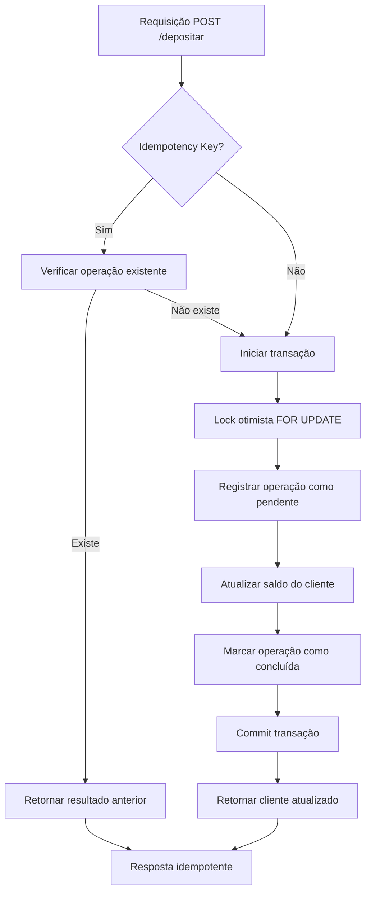
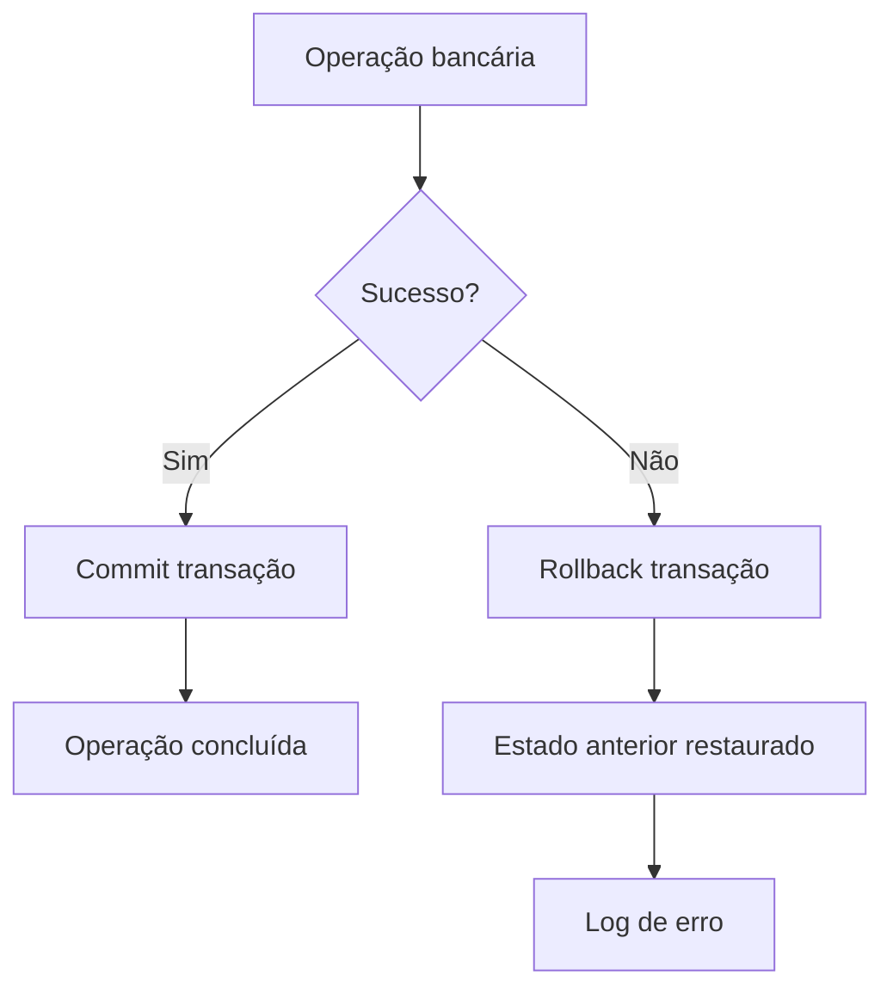

# 🔒 Transações e Idempotência - Implementação

## 📋 Visão Geral

Este documento descreve as melhorias implementadas para garantir **consistência de dados** e **idempotência** nas operações bancárias.

---

## ✅ **Problemas Resolvidos**

### **1. Inconsistência de Transações:**
- ❌ **Antes:** Operações bancárias não eram atômicas
- ❌ **Antes:** Race conditions em operações concorrentes
- ❌ **Antes:** Falhas parciais deixavam dados inconsistentes

### **2. Falta de Idempotência:**
- ❌ **Antes:** Reexecução de operações causava duplicação
- ❌ **Antes:** Sem controle de operações duplicadas
- ❌ **Antes:** APIs não eram seguras para retry

---

## 🚀 **Soluções Implementadas**

### **1. Sistema de Transações**

#### **🔧 Métodos de Transação:**
```javascript
// Iniciar transação
await db.beginTransaction();

// Commit da transação
await db.commitTransaction();

// Rollback da transação
await db.rollbackTransaction();
```

#### **🛡️ Lock Otimista:**
```javascript
// Lock otimista com FOR UPDATE
const clienteAtual = await this.db.get(
  'SELECT saldo FROM clientes WHERE id = ? FOR UPDATE',
  [id]
);
```

#### **📊 Auditoria de Operações:**
```sql
CREATE TABLE operacoes (
  id CHAR(36) PRIMARY KEY,
  cliente_id CHAR(36) NOT NULL,
  tipo ENUM('deposito', 'saque') NOT NULL,
  valor DECIMAL(17,2) NOT NULL,
  saldo_anterior DECIMAL(17,2) NOT NULL,
  saldo_posterior DECIMAL(17,2) NOT NULL,
  idempotency_key VARCHAR(255) UNIQUE,
  status ENUM('pendente', 'concluida', 'falhou') DEFAULT 'pendente',
  created_at TIMESTAMP DEFAULT CURRENT_TIMESTAMP,
  updated_at TIMESTAMP DEFAULT CURRENT_TIMESTAMP ON UPDATE CURRENT_TIMESTAMP
);
```

### **2. Sistema de Idempotência**

#### **🔑 Idempotency Keys:**
```javascript
// Gerar chave de idempotência
const idempotencyKey = crypto.randomBytes(16).toString('hex');

// Usar em requisições
const headers = {
  'Authorization': `Bearer ${token}`,
  'idempotency-key': idempotencyKey
};
```

#### **🔄 Verificação de Idempotência:**
```javascript
// Verificar se operação já foi executada
const operacaoExistente = await this.db.get(
  'SELECT * FROM operacoes WHERE idempotency_key = ? AND status = "concluida"',
  [idempotencyKey]
);

if (operacaoExistente) {
  // Retornar resultado da operação anterior
  return await this.findById(id);
}
```

#### **💾 Cache de Idempotência:**
```javascript
// Cache em memória (em produção, usar Redis)
this.idempotencyCache = new Map();
this.CACHE_TTL = 24 * 60 * 60 * 1000; // 24 horas
```

---

## 🎯 **Fluxo de Operação Bancária**

### **1. Depósito com Transação e Idempotência:**



### **2. Tratamento de Erros:**



---

## 📝 **Como Usar**

### **1. Operação com Idempotência:**

```bash
# Gerar idempotency key
IDEMPOTENCY_KEY=$(openssl rand -hex 16)

# Fazer depósito com idempotência
curl -X POST http://localhost:8080/api/clientes/{id}/depositar \
  -H "Authorization: Bearer {token}" \
  -H "idempotency-key: $IDEMPOTENCY_KEY" \
  -H "Content-Type: application/json" \
  -d '{"valor": 100.00}'

# Reexecutar a mesma operação (retorna mesmo resultado)
curl -X POST http://localhost:8080/api/clientes/{id}/depositar \
  -H "Authorization: Bearer {token}" \
  -H "idempotency-key: $IDEMPOTENCY_KEY" \
  -H "Content-Type: application/json" \
  -d '{"valor": 100.00}'
```

### **2. Operação sem Idempotência:**

```bash
# Operação normal (pode ser executada múltiplas vezes)
curl -X POST http://localhost:8080/api/clientes/{id}/depositar \
  -H "Authorization: Bearer {token}" \
  -H "Content-Type: application/json" \
  -d '{"valor": 50.00}'
```

---

## 🧪 **Testes**

### **1. Executar Testes:**

```bash
# Iniciar servidor
npm start

# Em outro terminal, executar testes
node src/scripts/test-transactions-idempotency.js
```

### **2. Testes Automatizados:**

```javascript
// Teste de idempotência
const idempotencyKey = generateIdempotencyKey();
const deposito1 = await axios.post('/depositar', { valor: 100 }, { 
  headers: { 'idempotency-key': idempotencyKey } 
});
const deposito2 = await axios.post('/depositar', { valor: 100 }, { 
  headers: { 'idempotency-key': idempotencyKey } 
});

// deposito1.data.data.saldo === deposito2.data.data.saldo (true)
```

---

## 🔧 **Configuração**

### **1. Variáveis de Ambiente:**

```env
# Configurações de transação
DB_TRANSACTION_TIMEOUT=30000
DB_LOCK_TIMEOUT=10000

# Configurações de idempotência
IDEMPOTENCY_CACHE_TTL=86400000  # 24 horas
IDEMPOTENCY_CLEANUP_INTERVAL=3600000  # 1 hora
```

### **2. Banco de Dados:**

```sql
-- Índices para performance
CREATE INDEX idx_operacoes_cliente_id ON operacoes(cliente_id);
CREATE INDEX idx_operacoes_idempotency_key ON operacoes(idempotency_key);
CREATE INDEX idx_operacoes_created_at ON operacoes(created_at);
```

---

## 📊 **Benefícios**

### **1. Consistência:**
- ✅ **Operações atômicas** - tudo ou nada
- ✅ **Rollback automático** em caso de erro
- ✅ **Locks otimistas** para concorrência

### **2. Idempotência:**
- ✅ **Reexecução segura** de operações
- ✅ **Cache de resultados** para performance
- ✅ **Prevenção de duplicação**

### **3. Auditoria:**
- ✅ **Histórico completo** de operações
- ✅ **Rastreabilidade** de mudanças
- ✅ **Compliance** bancário

### **4. Performance:**
- ✅ **Cache inteligente** de idempotência
- ✅ **Índices otimizados** no banco
- ✅ **Limpeza automática** de dados expirados

---

## 🚨 **Considerações de Produção**

### **1. Cache Distribuído:**
```javascript
// Em produção, usar Redis em vez de Map
const redis = require('redis');
const client = redis.createClient();

// Armazenar idempotency key
await client.setex(`idempotency:${key}`, 86400, JSON.stringify(response));
```

### **2. Monitoramento:**
```javascript
// Métricas de transações
const metrics = {
  transactions: {
    total: 0,
    successful: 0,
    failed: 0,
    rollbacks: 0
  },
  idempotency: {
    cache_hits: 0,
    cache_misses: 0,
    keys_stored: 0
  }
};
```

### **3. Backup e Recuperação:**
```sql
-- Backup da tabela de operações
mysqldump -u user -p database operacoes > operacoes_backup.sql

-- Recuperação de operações pendentes
UPDATE operacoes SET status = 'falhou' 
WHERE status = 'pendente' 
AND created_at < DATE_SUB(NOW(), INTERVAL 1 HOUR);
```

---

## 🎯 **Conclusão**

A implementação de transações e idempotência garante:

1. **Consistência total** dos dados bancários
2. **Segurança** para reexecução de operações
3. **Auditoria completa** de todas as transações
4. **Performance otimizada** com cache inteligente
5. **Compliance** com regulamentações bancárias

O sistema está pronto para uso em produção com alta confiabilidade e escalabilidade.
